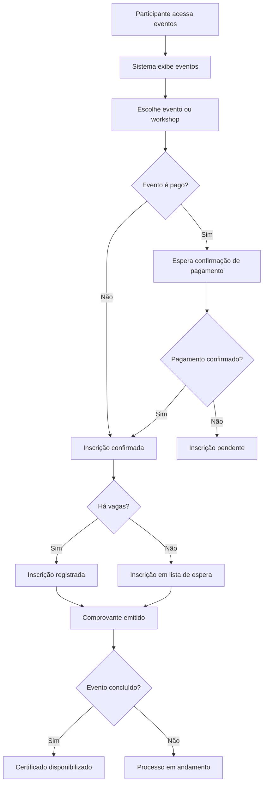
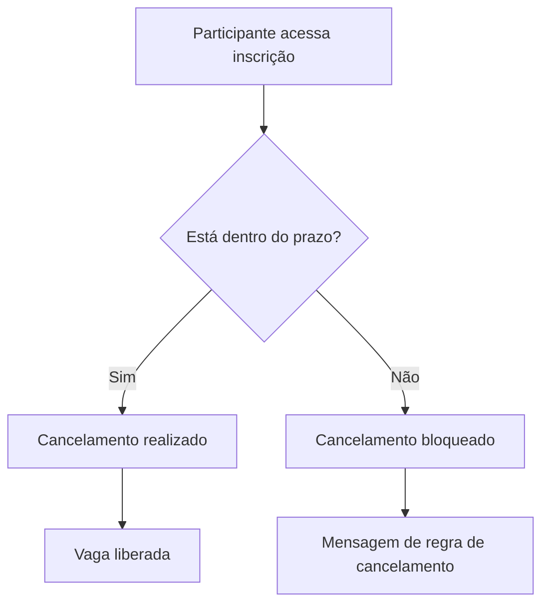
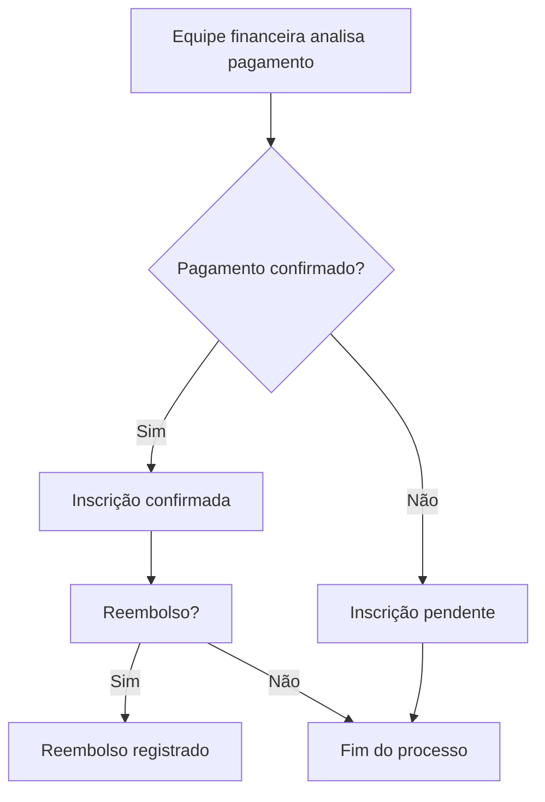

# Diagrama de Fluxo de Processo (BPMN)

## Objetivo
Este documento descreve os principais fluxos do sistema de gestão de eventos, conectando as histórias de usuário, regras de negócio e requisitos levantados na análise.

## Histórias de Usuário Cobertas
- HU-01: visualizar eventos.
- HU-02: inscrever-se em eventos e workshops.
- HU-03: emitir comprovante de inscrição.
- HU-04: cancelar inscrição.
- HU-05: emitir certificado.
- HU-06: inscrever-se em vários workshops no mesmo dia.
- HU-07: controlar vagas disponíveis.
- HU-08: criar lista de espera.
- HU-09: acompanhar inscritos em tempo real.
- HU-10: consultar lista de participantes.
- HU-11: confirmar pagamento e liberar inscrição.
- HU-12: acompanhar reembolsos.
- HU-13: acessar o sistema com segurança.
- HU-14: utilizar uma interface acessível e intuitiva.
- HU-15: garantir disponibilidade do sistema.

## Fluxo Principal de Inscrição
1. O participante acessa a página de eventos.
2. O sistema exibe os eventos disponíveis.
3. O participante seleciona um evento ou workshop.
4. O sistema verifica se o evento é gratuito ou pago.
5. Se for gratuito, a inscrição é confirmada imediatamente.
6. Se for pago, o sistema aguarda a confirmação do pagamento.
7. O sistema verifica a disponibilidade de vagas.
8. Se houver vagas, a inscrição é registrada.
9. Se não houver vagas, a inscrição é direcionada para lista de espera.
10. O sistema gera o comprovante de inscrição.
11. Ao fim do evento, o sistema disponibiliza o certificado, quando aplicável.

### Fluxograma Mermaid — Inscrição e participação

## Fluxo de Cancelamento
1. O participante acessa sua inscrição.
2. O sistema valida se o cancelamento está dentro do prazo permitido.
3. Se estiver dentro do prazo, a inscrição é cancelada.
4. O sistema atualiza a disponibilidade de vagas.
5. Se estiver fora do prazo, o cancelamento é bloqueado.

### Fluxograma Mermaid — Cancelamento

## Fluxo de Acompanhamento Financeiro
1. A equipe financeira verifica pagamentos.
2. O sistema mantém o status da inscrição como pendente ou confirmada.
3. Quando necessário, a equipe registra reembolsos.
4. O sistema atualiza o status de cada solicitação.

### Fluxograma Mermaid — Financeiro

## Observações
- O fluxo deve ser revisado após a definição da política de reembolso, envio de notificações e critérios de disponibilidade.
- O processo também deve considerar segurança, usabilidade e disponibilidade conforme os requisitos não funcionais.
